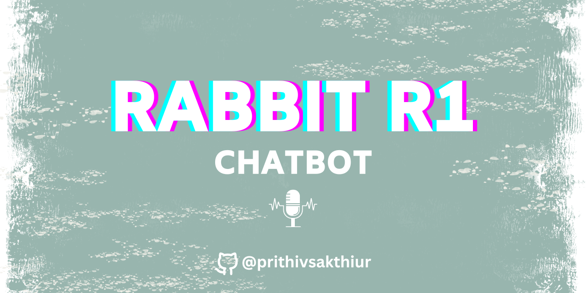
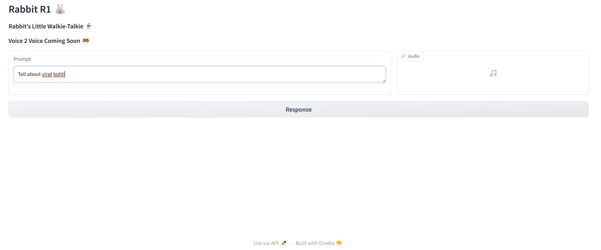
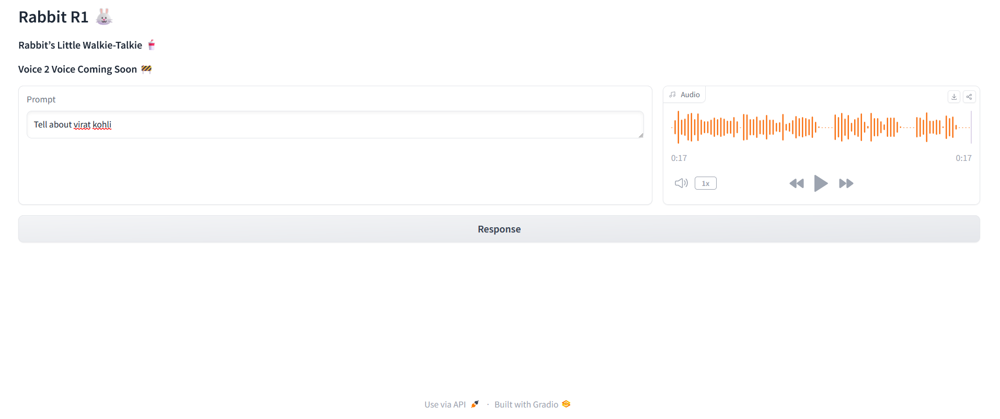

🚀Check out the configuration reference at : https://huggingface.co/docs/hub/spaces-config-reference

🚀Huggingface space : https://huggingface.co/spaces/prithivMLmods/RabbitR1-Strom-Chatbot

🚀To Clone Just Install Git Past the Command : git clone https://huggingface.co/spaces/prithivMLmods/RabbitR1-Strom-Chatbot

⛈️Input Prompt for computation : 

🐰Processing with Mistral LLM

🗞️🔉Output Audio con·​vo 

.

.

.
